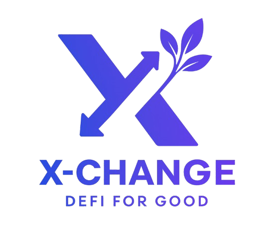

# 🔄 X-Change: Revolutionizing Charitable Giving Through DeFi



> **🏆 Built for OKX ETHCC 2025 Hackathon**
> **🌐 Live Demo**: [https://x-change-ezlcwcocv-alvinyap510s-projects.vercel.app/](https://x-change-ezlcwcocv-alvinyap510s-projects.vercel.app/)

---

## 🚀 The Revolutionary Idea

**What if you could help NGOs without losing your money?**

Traditional donations mean your money is gone forever. With **X-Change**, you stake your crypto (ETH/USDC) on behalf of NGOs. The yield goes to them, but after 6-24 months, **you get your original money back**.

### 💡 How It Works
1. **Pick an NGO** you care about from our verified registry
2. **Stake your tokens** (not donate) - choose USDC or WETH
3. **Set yield allocation** - 50%, 75%, or 100% of yield goes to the NGO
4. **Get your principal back** when the staking term ends (6, 12, or 24 months)

**Real Example**: Stake $1000 USDC for "Education for All" at 10% APY for 12 months, allocate 75% yield to them. The NGO gets $75, you get your $1000 back plus $25.

---

## 🏗️ Complete Architecture

### 🔗 Blockchain Infrastructure
- **Network**: X Layer Mainnet (Chain ID: 196)
- **All contracts deployed & verified** on X Layer explorer
- **3 verified NGOs** ready for staking
- **Mock tokens** with real yield generation (10% USDC, 8% WETH APY)

### 🎨 Frontend Experience
- **Next.js 15** with TypeScript
- **RainbowKit** wallet integration
- **Responsive design** with Tailwind CSS
- **Real-time price feeds** via OKX DEX API integration
- **Complete user flows**: Discovery → Staking → Portfolio tracking

### 🔧 Smart Contracts (All Verified ✅)

| Contract | Address | Explorer |
|----------|---------|----------|
| **NGORegistry** | `0x771a3e012eD22FEc509668593Cb12AA677C41Dbd` | [View](https://www.oklink.com/xlayer/address/0x771a3e012eD22FEc509668593Cb12AA677C41Dbd) |
| **MorphImpactStaking** | `0x1340faD914A325AE274a4FDF168a528429907e35` | [View](https://www.oklink.com/xlayer/address/0x1340faD914A325AE274a4FDF168a528429907e35) |
| **MockYieldVault** | `0x9123F2c69f1990DdA4a1588c89e49E1B39eE25b1` | [View](https://www.oklink.com/xlayer/address/0x9123F2c69f1990DdA4a1588c89e49E1B39eE25b1) |
| **YieldDistributor** | `0xC1c3837ca85886AC13672b48E54aa827e643926e` | [View](https://www.oklink.com/xlayer/address/0xC1c3837ca85886AC13672b48E54aa827e643926e) |
| **MockUSDC** | `0xa2dCeE55cD951D809C0762574ed4016E31E18419` | [View](https://www.oklink.com/xlayer/address/0xa2dCeE55cD951D809C0762574ed4016E31E18419) |
| **MockWETH** | `0x94117FD7961b2DDd56725DfD5Ba2FcCFc56F3282` | [View](https://www.oklink.com/xlayer/address/0x94117FD7961b2DDd56725DfD5Ba2FcCFc56F3282) |

---

## 🌟 Hackathon Requirements & Features

### ✅ OKX Integration (Mandatory)
- **Real OKX DEX API Integration**: Authenticated HMAC-SHA256 calls to `/api/v5/dex/aggregator/quote`
- **Live Price Ticker**: Real-time crypto prices with 24h changes
- **Token Swap Interface**: Full swap functionality with OKX DEX routing
- **Authentication Demo**: Clear display of API integration for judges
- **Rate Limiting & Caching**: Smart API usage with fallback mechanisms

### ✅ X Layer Deployment
- **Native X Layer Support**: All contracts deployed on X Layer Mainnet
- **OKB Integration**: OKB featured prominently in swap interface
- **Explorer Integration**: All contracts verified on OKLink explorer
- **Gas Optimization**: Efficient contract deployment with 1 gwei gas price

### ✅ Real-World Impact
- **3 Verified NGOs**: Education for All, Clean Water Initiative, HealthCare Access
- **Live Staking**: Users can immediately stake USDC/WETH for real NGOs
- **Yield Distribution**: Actual yield generation and distribution mechanisms
- **Portfolio Tracking**: Complete position management and yield tracking

---

## 🛠️ Technical Implementation

### Smart Contract Features
- **Role-based NGO Registry**: Secure NGO registration with admin verification
- **Flexible Staking Terms**: 6, 12, or 24-month lock periods
- **Yield Allocation Options**: 50%, 75%, or 100% to NGO
- **Position NFTs**: Each stake represented as transferable NFT
- **Emergency Functions**: Pause/unpause and emergency withdrawal capabilities
- **Comprehensive Events**: Full event logging for transparency

### Frontend Features
- **Wallet Integration**: Multi-wallet support via RainbowKit
- **NGO Discovery**: Beautiful card-based NGO browsing with filtering
- **Staking Interface**: Intuitive staking flow with real-time calculations
- **Portfolio Dashboard**: Track all positions with yield estimates
- **NGO Self-Registration**: Complete onboarding flow for new NGOs
- **Price Integration**: Live crypto prices and OKX DEX integration

### Security & Quality
- **Foundry Testing**: Comprehensive test suite for all contracts
- **Gas Optimization**: Efficient contract interactions
- **Error Handling**: Robust error handling throughout the app
- **Type Safety**: Full TypeScript implementation

---

## 🚀 Getting Started

### Prerequisites
- Node.js 18+
- pnpm
- Foundry
- X Layer testnet/mainnet RPC access

### Quick Start

```bash
# Clone repository
git clone <repo-url>
cd hackathon-2025-ethcc-okx-xchange

# Backend setup
cd backend
forge install
forge test

# Frontend setup
cd ../frontend
pnpm install
cp .env.example .env.local
# Add your OKX API credentials to .env.local
pnpm dev
```

### Environment Variables
```bash
# Frontend (.env.local)
NEXT_PUBLIC_OKX_API_KEY=your_okx_api_key
NEXT_PUBLIC_OKX_SECRET_KEY=your_okx_secret_key
NEXT_PUBLIC_OKX_API_PASSPHRASE=your_passphrase

# Backend
PRIVATE_KEY=your_private_key
RPC=https://rpc.xlayer.tech
```

---

## 📱 User Experience Flow

### 1. **Discover NGOs**
- Browse verified NGOs with rich profiles
- Filter by cause type (Education, Environment, Health)
- View NGO impact metrics and descriptions

### 2. **Stake for Impact**
- Select staking amount (USDC or WETH)
- Choose lock period (6, 12, or 24 months)
- Set yield contribution (50%, 75%, or 100%)
- Approve tokens and confirm stake

### 3. **Track Portfolio**
- View all active stakes
- Monitor yield generation
- Track NGO impact
- Manage positions

### 4. **Swap & Trade**
- Integrated OKX DEX for token swaps
- Real-time price feeds
- Support for OKB, USDC, WETH, ETH

---

## 🏆 Why X-Change Wins

### 💰 **Sustainable Impact Model**
- **Donors keep their principal** - removes psychological barrier to giving
- **NGOs get predictable yield** - sustainable funding model
- **More people willing to participate** - no permanent loss means broader adoption

### 🔧 **Technical Excellence**
- **Production-ready deployment** on X Layer Mainnet
- **Real OKX API integration** with authentication
- **Comprehensive user experience** from discovery to portfolio management
- **Security-first approach** with tested smart contracts

### 🌍 **Real-World Utility**
- **Immediate usability** - 3 NGOs ready for staking
- **Scalable architecture** - easy to add more NGOs and tokens
- **Clear value proposition** - bridges DeFi and social impact
- **Market-ready solution** - complete product, not just demo

### 🚀 **Innovation Factor**
- **Novel approach to charity** - staking instead of donating
- **DeFi for social good** - leverages yield farming for philanthropy
- **Gamified giving** - NFT positions and yield tracking
- **Cross-chain potential** - architecture supports multiple networks

---

## 📊 Demo Data & Testing

### Pre-loaded NGOs
1. **Education for All** - Digital learning for underprivileged children
2. **Clean Water Initiative** - Sustainable water systems
3. **HealthCare Access** - Mobile clinics and telemedicine

### Test Tokens (X Layer Mainnet)
- **MockUSDC**: 10% APY, 50k available in vault
- **MockWETH**: 8% APY, 50 WETH available in vault

### Testing Flow
1. Connect wallet to X Layer Mainnet
2. Visit [live demo](https://x-change-ezlcwcocv-alvinyap510s-projects.vercel.app/)
3. Browse NGOs at `/discover`
4. Stake tokens for any NGO
5. Track positions in `/portfolio`
6. Try token swapping at `/swap`

---

## 🔮 Future Roadmap

- **Multi-chain expansion** (Ethereum, Polygon, Arbitrum)
- **Real yield protocols** (Aave, Compound integration)
- **Impact reporting** (on-chain impact metrics)
- **DAO governance** (community-driven NGO verification)
- **Mobile app** (React Native implementation)
- **Fiat onramps** (credit card to stake)

---

## 👥 Team & Acknowledgments

**Built with ❤️ for social impact**

- Smart contract development with Foundry
- Frontend built with Next.js + TypeScript
- Deployed on X Layer Mainnet
- Integrated with OKX DEX API
- Inspired by the vision of sustainable philanthropy

---

## 📜 License

MIT License - Built for OKX ETHCC 2025 Hackathon

---

**🌟 X-Change: Where DeFi meets philanthropy, and everyone wins. 🌟**